# Поднимаем тестовое окружение в Kubernetes: Apache Kafka, Kafka Connect, MirrorMaker 2.0 и Jmeter

Я инженер по нагрузочному тестированию и не так давно работаю над проектом, где предполагается активное использование Apache Kafka. Из-за режима удаленной работы получение доступа к тестовому окружению затянулось на недели. Чтобы не терять время я решил развернуть локальный стенд в Kubernetes.

Кто работал с Apache Kafka подтвердит, что официальная документация покрывает далеко не все тонкости инсталляции и настройки. Я надеюсь, что данная пошаговая инструкция позволит вам сократить время развертывания тестового окружения. Обращаю внимание на то, что установка stateful в контейнерах - далеко не лучшая идея, поэтому данная инструкция не предназначена для развертывания промышленного стенда.

Инструкция описывает создание виртуальной машины в VirtualBox, установку и настройку операционной системы, установку Docker, Kubernetes и системы мониторинга. В Kubernetes развертывается два кластера Apache Kafka: "production" и "backup". Для репликации сообщений из production в backup используется MirrorMaker 2.0. Взаимодействие между узлами production кластера защищено TLS. К сожалению, не могу выложить в Git скрипт для генерирования сертификатов. В качестве примера можете использовать сертификаты из архива certs/certs.tar.gz. В самом конце инструкции описывается развертывание кластера Jmeter и запуск тестового сценария.

Инструкция расcчитана на новичков в Kubernetes, поэтому если вы уже имеете опыт работы с контейнерами, то можете сразу перейти в раздел ["12. Разворачиваем кластер Apache Kafka"](#deploy-cluster).

### Q&A:
- <b>Почему используется Ubuntu?</b> Изначально я развернул Kubernetes в CentOS 7, но после одного из обновлений окружение перестало работать. К тому же я заметил, что в CentOS нагрузочные тесты, запущенные в Jmeter, ведут себя непредсказуемо. Если сталкивались, пожалуйста, напишите в комментариях возможное решение этой проблемы. В Ubuntu всё намного стабильнее.
- <b>Почему не k3s или MicroK8s?</b> Если коротко, ни k3s, ни MicroK8s из коробки не умеют работать с локальным Docker-репозиторием.
- <b>Почему не оптимизированы параметры конфигурации?</b> Я намеренно использовал параметры по умолчанию где это возможно. 
- <b>Почему Flannel?</b> Я новичок в kubernetes и Flannel - единственный плагин, который мне удалось завести без проблем.
- <b>Почему Docker, а не CRI-O?</b> Мне интересен CRI-O и я планирую изучить его в будущем.
- <b>Почему MirrorMaker 2.0 развернут в Kafka Connect?</b> Kafka Connect позволяет редактировать параметры конфигурации MirrorMaker 2.0 "на лету" через REST API.

## Оглавление

[1. Создание виртуальной машины](#create-vm)

[2. Установка Ubuntu Server 20.04](#install-ubuntu)

[3. Настройка Ubuntu](#setup-ubuntu)

[4. Установка Docker](#install-docker)

[5. Настройка iptables](#setup-iptables)

[6. Установка kubeadm, kubelet и kubectl](#install-kubeadm-kubelet-kubectl)

[7. Разворачиваем кластер Kubernetes](#kubeadm-init)

[8. Устанавливаем Flannel](#deploing-flannel)

[9. Разрешаем запуск pod-ов на ноде control-plane](#control-plane-node-isolation)

[10. Добавляем алиас для команды kubectl](#kubectl-alias)

[11. Устанавливаем Prometheus, Grafana, Alert Manager и Node Exporter](#deploing-monitoring)

[12. Разворачиваем кластер Apache Kafka](#deploy-cluster)

[12.1. Запускаем Apache Zookeeper](#deploy-zookeeper)

[12.2. Запускаем Apache Kafka](#deploy-kafka)

[13. Проверяем отправку и получение сообщений](#check)

[13.1. Запускаем генератор сообщений](#run-producer)

[13.2. Запускаем получателя сообщений](#run-consumer)

[14. Настраиваем репликацию сообщений с помощью MirrorMaker 2.0](#mirrormaker)

[14.1. Запуск MirrorMaker 2.0 как конектор в кластере Kafka Connect](#deploy-mirrormaker)

[14.2. Проверяем репликацию сообщений](#check-replication)

[15. Выполнение сценариев Jmeter](#run-jmeter)

[16. Удаление данных](#delete)

***

### <a name="create-vm">1. Создание виртуальной машины</a>
Виртуальной машине должно быть доступно как минимум 2 ядра ЦПУ и 6-8 ГБ оперативной памяти. Если нет возможности выделить достаточный объем оперативной памяти для виртуальной машины, то посмотрите в сторону [Rancher K3S](https://k3s.io).

<details>
  <summary>Показать скриншоты</summary>

  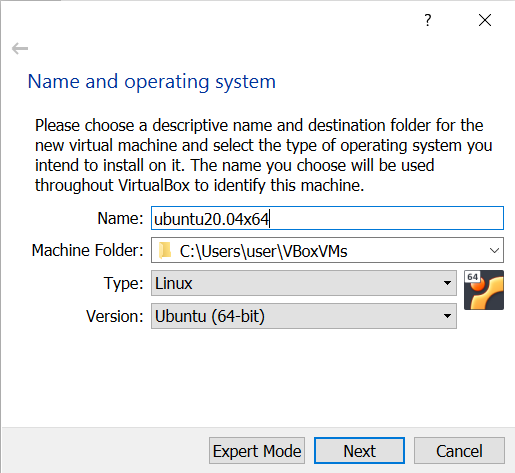

  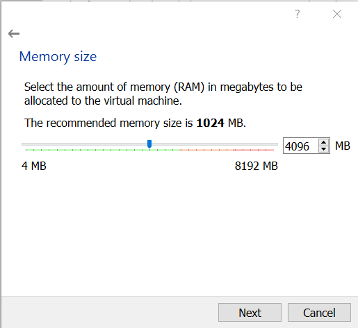

  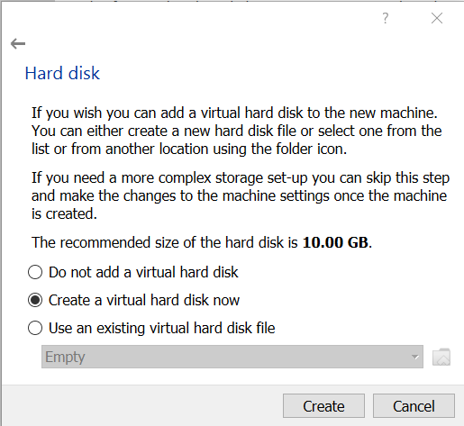

  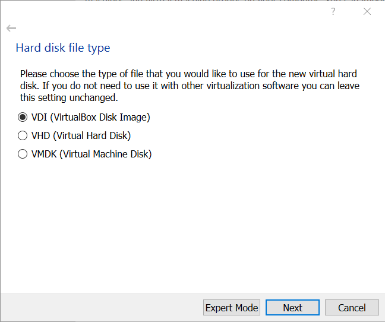

  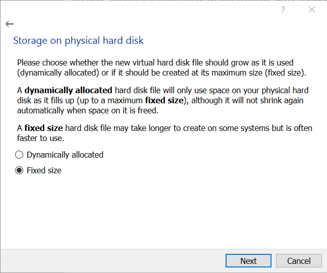

  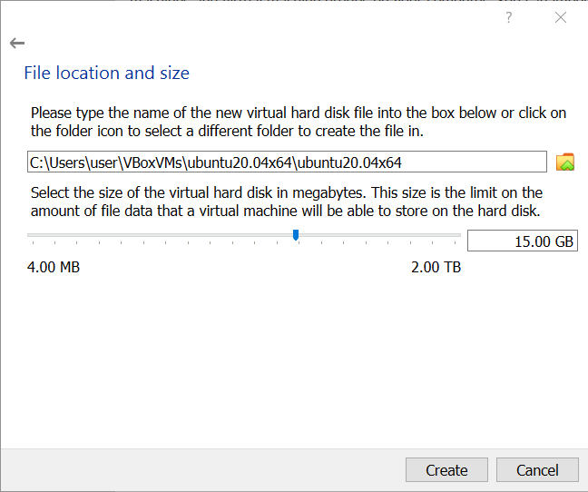
</details>

### <a name="install-ubuntu">2. Установка Ubuntu Server 20.04</a>
Установка операционной системы довольно тривиальный процесс, но на всякий случай  приведу скриншоты. На что нужно обратить внимание:
 - IP адрес, который будет присвоен ноде (по умолчанию 10.0.2.15); 
 - Kubernetes требует, чтобы swap был отключен, поэтому дисковые разделы необходимо создать вручную;
 - В самом конце процесса установки можно выбрать опцию "Install OpenSSH server".
<details>
  <summary>Показать скриншоты</summary>

  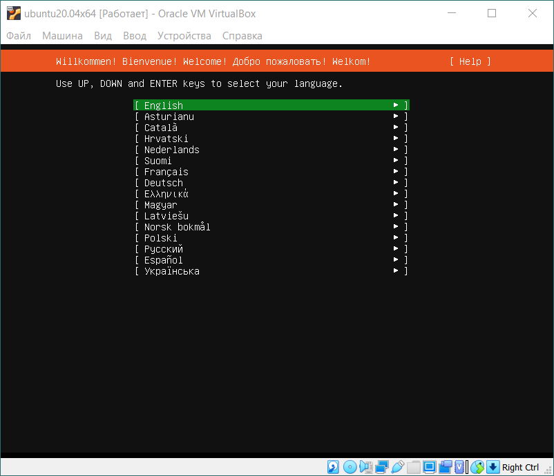

  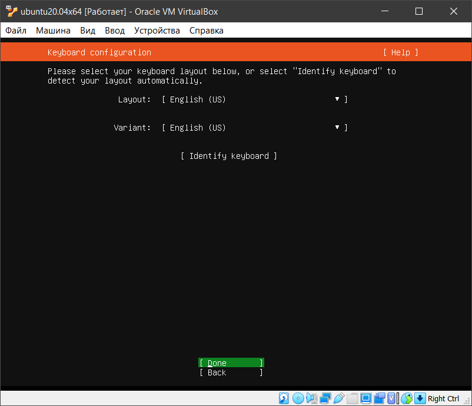

  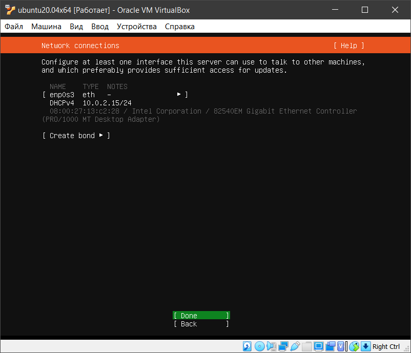

  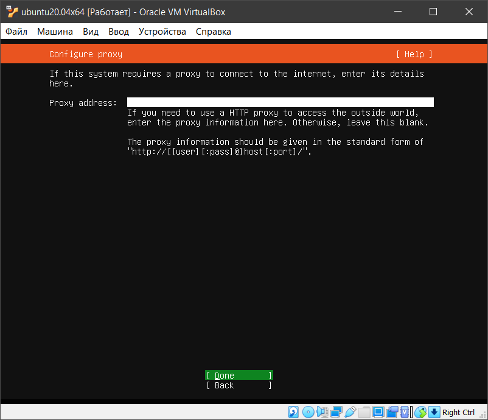

  

  

  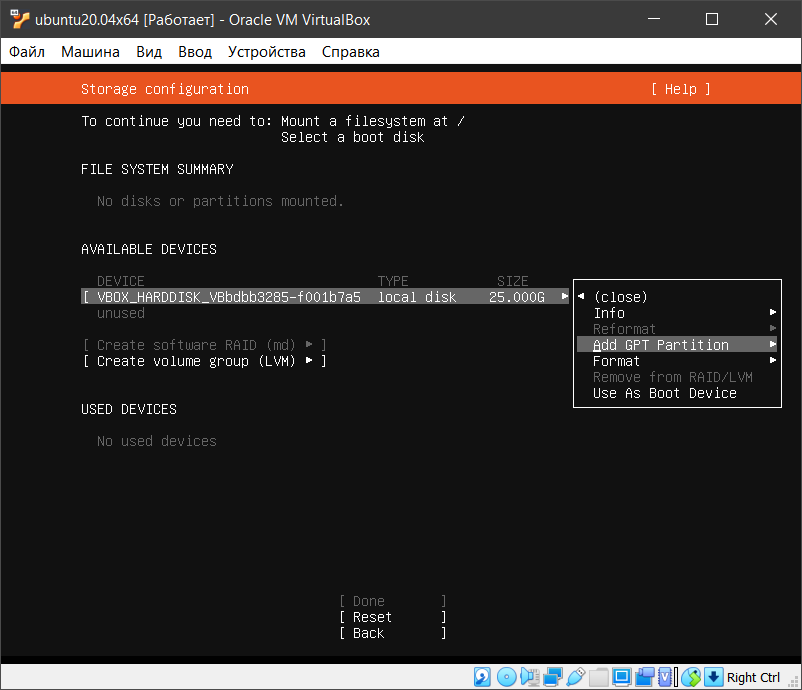

  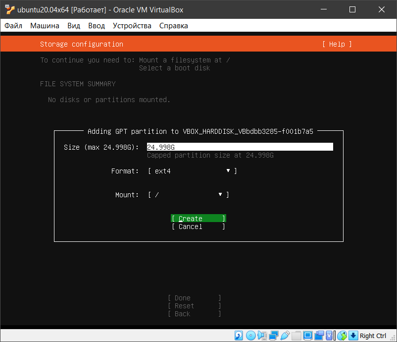

  

  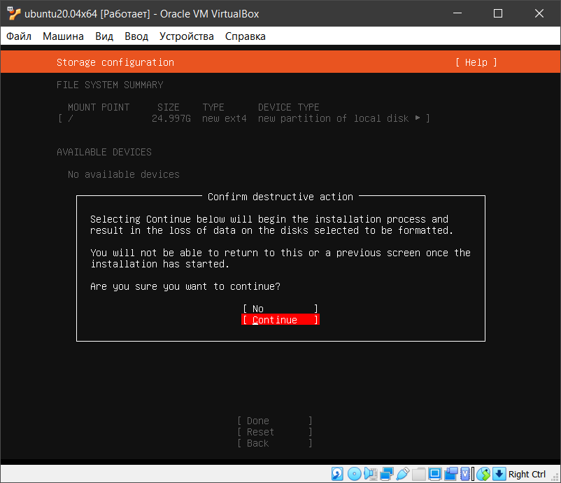

  

  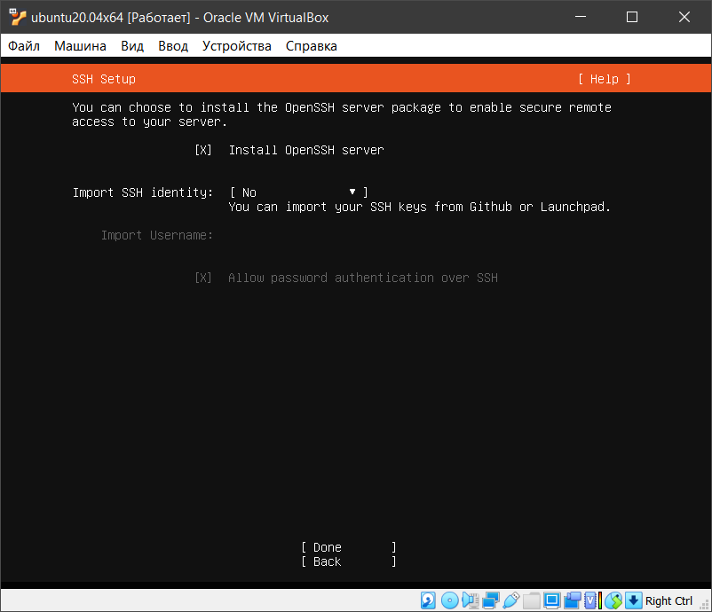

  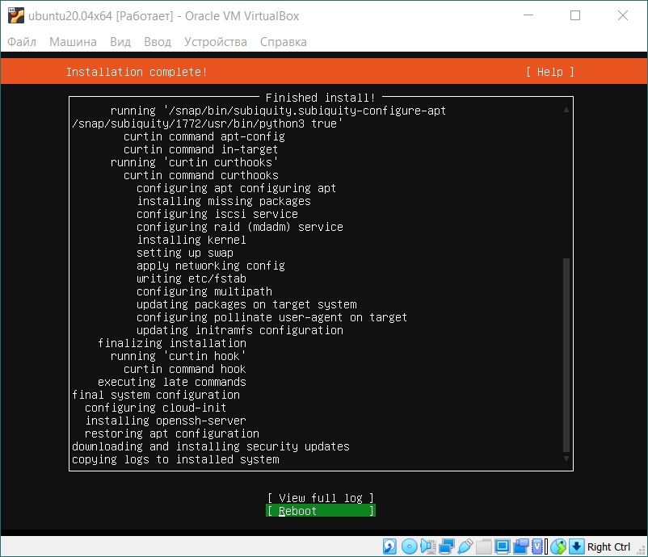
</details>

### <a name="setup-ubuntu">3. Настройка Ubuntu</a>
#### <a name="disable-firewall">3.1. Отключить Firewall</a>
```bash
sudo ufw disable
```
#### <a name="disable-swap">3.2. Отключить Swap</a>
```bash
sudo swapoff -a

sudo sed -i 's/^\/swap/#\/swap/' /etc/fstab
```
#### <a name="install-jdk">3.3. Установить OpenJDK</a>
В поставку OpenJDK входит утилита keytool, которая понадобится для генерирования сертификатов:
```bash
sudo apt install openjdk-8-jdk-headless
```
#### <a name="auth-by-key">3.4. Авторизация по ключу (опционально)</a>
Подробная инструкция от DigitalOcean: 
https://www.digitalocean.com/community/tutorials/how-to-set-up-ssh-keys-on-ubuntu-20-04-ru

### <a name="install-docker">4. Установка Docker</a> <sup><a href="https://kubernetes.io/docs/setup/production-environment/container-runtimes/">[источник]</a></sup>
```bash
# Switch to the root user 
sudo su

# (Install Docker CE)
## Set up the repository:
### Install packages to allow apt to use a repository over HTTPS
apt-get update && apt-get install -y \
  apt-transport-https ca-certificates curl software-properties-common gnupg2

# Add Docker’s official GPG key:
curl -fsSL https://download.docker.com/linux/ubuntu/gpg | apt-key add -

# Add the Docker apt repository:
add-apt-repository \
  "deb [arch=amd64] https://download.docker.com/linux/ubuntu \
  $(lsb_release -cs) \
  stable"

# Install Docker CE
apt-get update && apt-get install -y \
  containerd.io=1.2.13-2 \
  docker-ce=5:19.03.11~3-0~ubuntu-$(lsb_release -cs) \
  docker-ce-cli=5:19.03.11~3-0~ubuntu-$(lsb_release -cs)

# Set up the Docker daemon
cat > /etc/docker/daemon.json <<EOF
{
  "exec-opts": ["native.cgroupdriver=systemd"],
  "log-driver": "json-file",
  "log-opts": {
    "max-size": "100m"
  },
  "storage-driver": "overlay2"
}
EOF

mkdir -p /etc/systemd/system/docker.service.d

# Restart Docker
systemctl daemon-reload
systemctl restart docker

# If you want the docker service to start on boot, run the following command:
sudo systemctl enable docker
```

### <a name="setup-iptables">5. Настройка iptables</a> <sup><a href="https://kubernetes.io/docs/setup/production-environment/tools/kubeadm/install-kubeadm/#letting-iptables-see-bridged-traffic">[источник]</a></sup>

```bash
cat <<EOF | sudo tee /etc/sysctl.d/k8s.conf
net.bridge.bridge-nf-call-ip6tables = 1
net.bridge.bridge-nf-call-iptables = 1
EOF

sudo sysctl --system
```

### <a name="install-kubeadm-kubelet-kubectl">6. Установка kubeadm, kubelet и kubectl</a> <sup><a href="https://kubernetes.io/docs/setup/production-environment/tools/kubeadm/install-kubeadm/#installing-kubeadm-kubelet-and-kubectl">[источник]</a></sup>
```bash
sudo apt-get update && sudo apt-get install -y apt-transport-https curl

curl -s https://packages.cloud.google.com/apt/doc/apt-key.gpg | sudo apt-key add -

cat <<EOF | sudo tee /etc/apt/sources.list.d/kubernetes.list
deb https://apt.kubernetes.io/ kubernetes-xenial main
EOF

sudo apt-get update

sudo apt-get install -y kubelet kubeadm kubectl

sudo apt-mark hold kubelet kubeadm kubectl
```

### <a name="kubeadm-init">7. Разворачиваем кластер Kubernetes</a>
Запускаем инициализацию ноды control-plane: <sup><a href="https://github.com/coreos/flannel/blob/master/Documentation/kubernetes.md#kubeadm">[источник]</a></sup>

```bash
# Pulling images required for setting up a Kubernetes cluster
# This might take a minute or two, depending on the speed of your internet connection
sudo kubeadm config images pull

# Initialize a Kubernetes control-plane node
sudo kubeadm init --pod-network-cidr=10.244.0.0/16
```

Следующие команды необходимо выполнить под обычным пользователем (не root): <sup><a href="https://kubernetes.io/docs/setup/production-environment/tools/kubeadm/create-cluster-kubeadm/#more-information">[источник]</a></sup>
```bash
mkdir -p $HOME/.kube
sudo cp -i /etc/kubernetes/admin.conf $HOME/.kube/config
sudo chown $(id -u):$(id -g) $HOME/.kube/config
```

### <a name="deploing-flannel">8. Устанавливаем Flannel</a> <sup><a href="https://github.com/coreos/flannel#deploying-flannel-manually">[источник]</a></sup>
```bash
kubectl apply -f https://raw.githubusercontent.com/coreos/flannel/master/Documentation/kube-flannel.yml
```


### <a name="control-plane-node-isolation">9. Разрешаем запуск pod-ов на ноде control-plane</a> <sup> <a href="https://kubernetes.io/docs/setup/production-environment/tools/kubeadm/create-cluster-kubeadm/#control-plane-node-isolation">[источник]</a> </sup>
Так как наш кластер Kubernetes развернут в режиме standalone, то необходимо разрешить запуск pod-ов на ноде control-plane:
```bash
kubectl taint nodes --all node-role.kubernetes.io/master-
```

### <a name="kubectl-alias">10. Добавляем алиас для команды kubectl</a> <sup><a href="https://kubernetes.io/docs/reference/kubectl/cheatsheet/#bash">[источник]</a></sup>
```bash
alias k='kubectl'

echo "alias k='kubectl'" >> ~/.bashrc
```

### <a name="deploing-monitoring">11. Устанавливаем Prometheus, Grafana, Alert Manager и Node Exporter</a>
Устанавливаем kube-prometheus: <sup><a href="https://github.com/coreos/kube-prometheus#quickstart">[источник]</a></sup>

```bash
curl -O -L https://github.com/coreos/kube-prometheus/archive/master.zip

sudo apt install -y unzip

unzip master.zip

cd kube-prometheus-master

kubectl create -f manifests/setup

kubectl create -f manifests/
```

Выполните следующую команду, чтобы посмотреть процесс запуска pod-ов. Необходимо дождаться когда все pod-ы перейдут в статус Running:
```bash
kubectl get pods -w -n monitoring
```
Для сбора метрик Kafka и Zookeeper будем использовать JMX Exporter. Чтобы Prometheus получил доступ к экспортируемым метрикам необходимо добавить ServiceMonitor:
```bash
k apply -f servicemonitor/jmx-exporter-servicemonitor.yaml
```
Создадим сервис, чтобы получить доступ к веб-интерфейсу Grafana из виртуальной машины:
```bash
kubectl apply -f https://raw.githubusercontent.com/kildibaev/k8s-kafka/master/service/grafana-svc.yaml
```
После запуска сервиса Grafana будет доступна из гостевой системы по адресу http://localhost:32000

Выполним проброс порта, чтобы получить доступ к Grafana на хост машине:

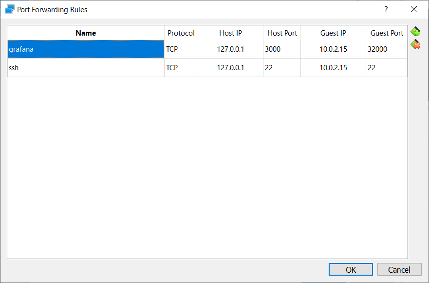

Теперь веб-интерфейс Grafana доступен на хост машине по адресу http://127.0.0.1:3000

Для просмотра метрик в Grafana можете воспользоваться готовым дашбордом. Для этого перейдите на страницу http://127.0.0.1:3000/dashboard/import и в поле "Import via panel json" скопируйте содержимое файла [grafana-dashboard.json](https://raw.githubusercontent.com/kildibaev/k8s-kafka/master/config/grafana-dashboard.json)


### <a name="deploy-cluster">12. Разворачиваем кластер Apache Kafka</a>

```bash
# Скачиваем содержимое репозитория
git clone https://github.com/kildibaev/k8s-kafka.git $HOME/k8s-kafka
cd $HOME/k8s-kafka
```

#### <a name="deploy-zookeeper">12.1. Запускаем Apache Zookeeper</a>
Чтобы получить предсказуемые имена хостов воспользуемся Statefulset. В нашем случае кластер Apache Zookeeper будет состоять из трех инстансов: zookeeper-0.zookeeper, zookeeper-1.zookeeper и zookeeper-2.zookeeper

```bash
# Собираем образ zookeeper-base
sudo docker build -t zookeeper-base:local-v1 -f dockerfile/zookeeper-base.dockerfile .

# Запускаем сервис Zookeeper
k apply -f service/zookeeper-svc.yaml

# Запускаем кластер Apache Zookeeper
k apply -f statefulset/zookeeper-statefulset.yaml

# Перед выполнением следующих шагов необходимо дождаться когда все три pod-а перейдут в статус Running. Проверить состояние pod-ов можно следующей командой:
k get pods -w
```

#### <a name="deploy-kafka">12.2. Запускаем Apache Kafka</a>
Кластер Apache Kafka будет состоять из двух брокеров: kafka-0.kafka и kafka-1.kafka
```bash
# Собираем образ kafka-base
sudo docker build -t kafka-base:local-v1 -f dockerfile/kafka-base.dockerfile .

# Запускаем сервис Kafka
k apply -f service/kafka-svc.yaml

# Запускаем кластер Apache Kafka
k apply -f statefulset/kafka-statefulset.yaml

# Перед выполнением следующих шагов необходимо дождаться когда оба pod-а перейдут в статус Running. Проверить состояние pod-ов можно следующей командой:
k get pods -w
```

### <a name="check">13. Проверяем отправку и получение сообщений</a>
#### <a name="run-producer">13.1. Запускаем генератор сообщений</a>
Запустим генератор сообщений, который будет отправлять 10 сообщений в секунду. Размер каждого сообщения составляет 100 байт. В общей сложности будет отправлено 30000 сообщений.
```bash
# Запускаем новый pod - producer
k run --rm -i --tty producer --image=kafka-base:local-v1 -- bash

# Создаем топик topicname и отправляем в него сообщения
bin/kafka-producer-perf-test.sh \
   --topic topicname \
   --num-records 30000 \
   --record-size 100 \
   --throughput 10 \
   --producer.config /config/client.properties \
   --producer-props acks=1 \
   bootstrap.servers=kafka-0.kafka:9092,kafka-1.kafka:9092 \
   buffer.memory=33554432 \
   batch.size=8196
```

#### <a name="run-consumer">13.2. Запускаем получателя сообщений</a>
```bash
# Запускаем новый pod - consumer
k run --rm -i --tty consumer --image=kafka-base:local-v1 -- bash 

# Получаем сообщения из топика topicname
bin/kafka-consumer-perf-test.sh \
--broker-list kafka-0.kafka:9092,kafka-1.kafka:9092 \
--consumer.config /config/client.properties \
--messages 30000 \
--topic topicname \
--threads 2
```

### <a name="mirrormaker">14. Настраиваем репликацию сообщений с помощью MirrorMaker 2.0</a>
#### <a name="deploy-mirrormaker">14.1. Запуск MirrorMaker 2.0 как конектор в кластере Kafka Connect</a>
Кластер Apache Kafka, который мы запустили ранее, условно назовем production. Поднимем еще один pod, в котором будет запущено три контейнера: Apache Zookeeper, Apache Kafka и Kafka Connect. Новый инстанс Apache Kafka назовем backup и настроим репликацию сообщений из production в backup.
```bash
k apply -f service/mirrormaker-svc.yaml

# Поднимем pod, в котором будет запущено три контейнера: Apache Zookeeper, Apache Kafka и Kafka Connect
k apply -f statefulset/mirrormaker-statefulset.yaml

# Необходимо дождаться когда pod с именем mirrormaker-0 перейдет в статус Running
k get pods -w

# Подключимся к контейнеру connect в pod-е mirrormaker-0 и откроем командную строку
k exec -ti mirrormaker-0 -c connect -- bash

# В кластере Kafka Connect создадим коннектор MirrorMaker 2.0
curl -X POST -H "Content-Type: application/json" mirrormaker-0.mirrormaker:8083/connectors -d \
'{
    "name": "MirrorSourceConnector",
    "config": {
      "connector.class": "org.apache.kafka.connect.mirror.MirrorSourceConnector",
      "source.cluster.alias": "production",
      "target.cluster.alias": "backup",
      "source.cluster.bootstrap.servers": "kafka-0.kafka:9092,kafka-1.kafka:9092",
      "source.cluster.group.id": "mirror_maker_consumer",
      "source.cluster.enable.auto.commit": "true",
      "source.cluster.auto.commit.interval.ms": "1000",
      "source.cluster.session.timeout.ms": "30000",
      "source.cluster.security.protocol": "SSL",
      "source.cluster.ssl.truststore.location": "/certs/kafkaCA-trusted.jks",
      "source.cluster.ssl.truststore.password": "kafkapilot",
      "source.cluster.ssl.truststore.type": "JKS",
      "source.cluster.ssl.keystore.location": "/certs/kafka-consumer.jks",
      "source.cluster.ssl.keystore.password": "kafkapilot",
      "source.cluster.ssl.keystore.type": "JKS",
      "target.cluster.bootstrap.servers": "localhost:9092",
      "target.cluster.compression.type": "none",
      "topics": ".*",
      "rotate.interval.ms": "1000",
      "key.converter.class": "org.apache.kafka.connect.converters.ByteArrayConverter",
      "value.converter.class": "org.apache.kafka.connect.converters.ByteArrayConverter"
    }
}'
```

#### <a name="check-replication">14.2. Проверяем репликацию сообщений</a>
Если репликация прошла успешно, то в backup будет создан топик production.topicname. Префикс ".production" MirrorMaker 2.0 добавит, чтобы избежать зацикливания, например, когда репликация настроена в режиме active-active.
```bash
# Запускаем новый pod - consumer
k exec -ti mirrormaker-0 -c kafka -- bash

# Получим список топиков 
bin/kafka-topics.sh --list --bootstrap-server mirrormaker-0.mirrormaker:9092

# Получаем сообщения из топика production.topicname
bin/kafka-console-consumer.sh \
--bootstrap-server mirrormaker-0.mirrormaker:9092 \
--topic production.topicname \
--from-beginning
```
Если топик production.topicname присутствует, но сообщения из него не считываются, проверьте логи Kafka Connect:
```bash
k logs mirrormaker-0 connect
```
Если в логах присутствуют следующие записи

```
ERROR WorkerSourceTask{id=MirrorSourceConnector-0} Failed to flush, timed out while waiting for producer to flush outstanding 1 messages (org.apache.kafka.connect.runtime.WorkerSourceTask:438)

ERROR WorkerSourceTask{id=MirrorSourceConnector-0} Failed to commit offsets (org.apache.kafka.connect.runtime.SourceTaskOffsetCommitter:114)
```
для решения проблемы можете уменьшить значение параметра producer.buffer.memory:
```bash
k exec -ti mirrormaker-0 -c connect -- bash

curl -X PUT -H "Content-Type: application/json" mirrormaker-0.mirrormaker:8083/connectors/MirrorSourceConnector/config -d \
'{
  "connector.class": "org.apache.kafka.connect.mirror.MirrorSourceConnector",
  "source.cluster.alias": "production",
  "target.cluster.alias": "backup",
  "source.cluster.bootstrap.servers": "kafka-0.kafka:9092,kafka-1.kafka:9092",
  "source.cluster.group.id": "mirror_maker_consumer",
  "source.cluster.enable.auto.commit": "true",
  "source.cluster.auto.commit.interval.ms": "1000",
  "source.cluster.session.timeout.ms": "30000",
  "source.cluster.security.protocol": "SSL",
  "source.cluster.ssl.truststore.location": "/certs/kafkaCA-trusted.jks",
  "source.cluster.ssl.truststore.password": "kafkapilot",
  "source.cluster.ssl.truststore.type": "JKS",
  "source.cluster.ssl.keystore.location": "/certs/kafka-consumer.jks",
  "source.cluster.ssl.keystore.password": "kafkapilot",
  "source.cluster.ssl.keystore.type": "JKS",
  "target.cluster.bootstrap.servers": "localhost:9092",
  "target.cluster.compression.type": "none",
  "topics": ".*",
  "rotate.interval.ms": "1000",
  "producer.buffer.memory:" "1000",
  "key.converter.class": "org.apache.kafka.connect.converters.ByteArrayConverter",
  "value.converter.class": "org.apache.kafka.connect.converters.ByteArrayConverter"
}'
```

### <a name="run-jmeter">15. Выполнение сценариев Jmeter</a>
```bash
# Собираем образ jmeter-base
sudo docker build -t jmeter-base:local-v1 -f dockerfile/jmeter-base.dockerfile .

# Запускаем сервис Jmeter
k apply -f service/jmeter-svc.yaml

# Запускаем четыре pod-а Jmeter, которые будут непосредственно генерировать нагрузку
k apply -f statefulset/jmeter-statefulset.yaml
```
Создадим pod jmeter-producer и выполним в нем сценарий producer.jmx
```bash
k run --rm -i --tty jmeter-producer --image=jmeter-base:local-v1 -- bash ./jmeter -n -t /tests/producer.jmx -r -Jremote_hosts=jmeter-0.jmeter:1099,jmeter-1.jmeter:1099
```
Создадим pod jmeter-consumer и выполним в нем сценарий consumer.jmx
```bash
k run --rm -i --tty jmeter-consumer --image=jmeter-base:local-v1 -- bash ./jmeter -n -t /tests/consumer.jmx -r -Jremote_hosts=jmeter-2.jmeter:1099,jmeter-3.jmeter:1099
```

### <a name="delete">16. Удаление данных</a>

#### Удаляем statefulset
```bash
k delete statefulset jmeter zookeeper kafka mirrormaker
```
#### Удаляем контейнеры
```bash
sudo docker rmi -f zookeeper-base:local-v1 kafka-base:local-v1 jmeter-base:local-v1
```

#### Удаляем сервисы
```bash
k delete svc grafana jmeter kafka mirrormaker zookeeper
k delete servicemonitor jmxexporter
```
<br><br><br>
<i>Всем добра! Не болейте.</i>
